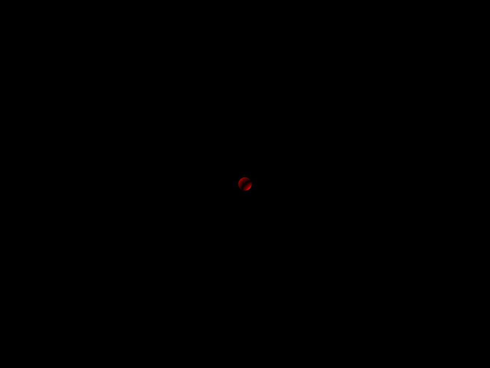
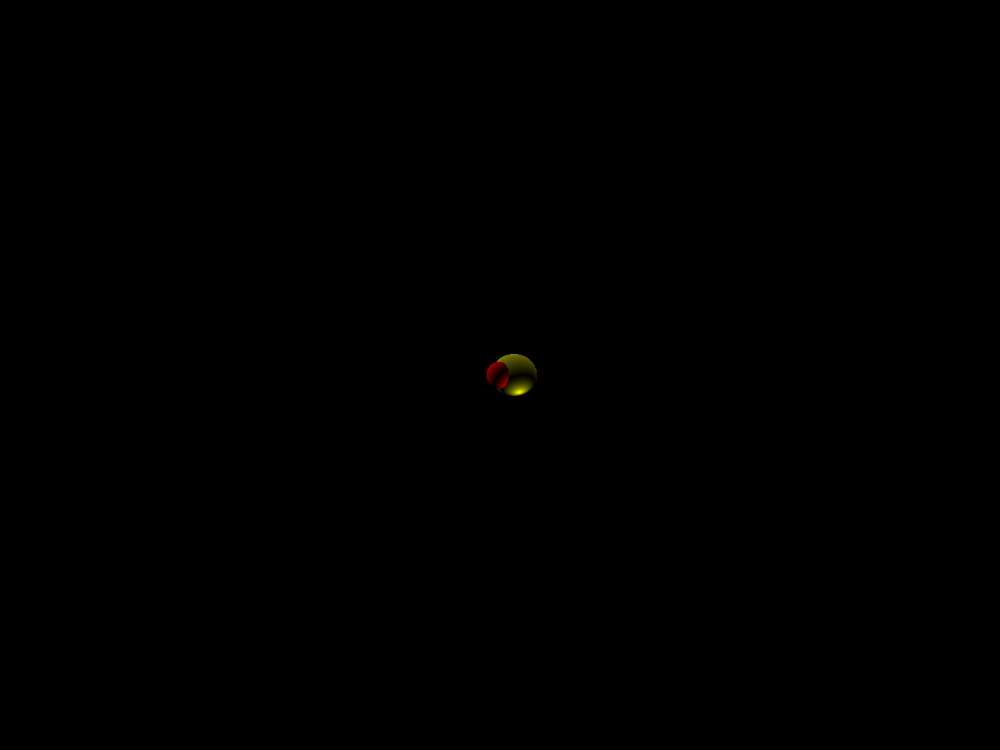

# renderer

A ray tracer based on the [raytracer construction kit](https://matklad.github.io/2022/12/31/raytracer-construction-kit.html) by matklad.

## Examples

- Circle
    
    [circle](examples/src/circle.rs)
- Sphere
    
    [sphere](examples/src/sphere.rs)
- Two Spheres
    
    [two_sphers](examples/src/two_spheres.rs)

## Libraries

- [geometry](./geometry)
- [image_lib](./image_lib)
- [colors](./colors)
- [renderer](./renderer)
